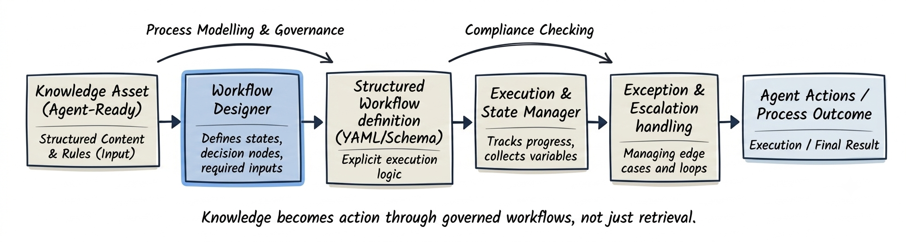

# Subproject 02: Agent Execution Workflows

### Turning structured knowledge into repeatable AI agent actions

Subproject 01 focused on helping AI agents understand knowledge.

But understanding knowledge is not the same as taking the right action.

An AI agent may know:
- *Company policies*
- *Business rules*
- *Product information*
- *Operational constraints*

Yet still fail to:

- *Follow the correct process*
- *Collect required information*
- *Escalate at the right time*
- *Produce consistent outcomes*

This subproject focuses on a critical challenge in AI-first systems:

**How do we ensure agents make decisions and execute workflows consistently?**

At a high level, the execution layer sits between knowledge and agent behavior:



---

## What this subproject is about

The goal is to design a workflow layer that helps agents move from:

**Knowing something**

to

**Doing the right thing**

consistently.

This includes defining:

- *Workflow states*
- *Decision points*
- *Required inputs*
- *Business rules*
- *Escalation paths*
- *Execution logic*

The result is a set of structured workflow definitions that guide agent behavior across common business processes.

This mirrors the type of work AI-first organizations perform when operationalizing knowledge for agent-driven systems.

---

## The problem being addressed

Traditional business processes are usually documented for human employees.

For example:

```text
If the customer requests a refund,
verify eligibility and process the request.
```

A human support representative can interpret that instruction using experience and judgment.

AI agents cannot.

When agents are given knowledge but no workflow guidance:

- *Required steps may be skipped*
- *Important information may not be collected*
- *Different agents may produce different outcomes*
- *Escalation rules may be applied inconsistently*
- *Business processes become difficult to govern and evaluate*

As organizations deploy more AI agents, workflow consistency becomes just as important as knowledge quality.

This subproject addresses that gap by:

- *Making workflow logic explicit*
- *Defining agent decision paths*
- *Structuring operational processes into reusable workflow assets*

---

## What's included in this subproject

This subproject includes:

- *A workflow design framework for AI agents*
- *A reusable workflow schema*
- *Example execution workflows*
- *Execution and state management models*
- *Before-and-after workflow examples*
- *Workflow evaluation criteria*
- *Failure mode analysis and governance considerations*

Each artifact is designed to reflect how workflow design may be approached within real AI product and operations teams.

---

## Folder overview

```text
02 Agent Execution Workflows/
│
├── README.md
│
├── problem/
│   └── knowledge_to_action_gap.md
│
├── workflow_design/
│   ├── workflow_principles.md
│   ├── workflow_vs_knowledge.md
│   └── workflow_patterns.md
│
├── schemas/
│   └── workflow_schema.yaml
│
├── workflows/
│   ├── refund_workflow.yaml
│   ├── cancellation_workflow.yaml
│   └── escalation_workflow.yaml
│
├── execution/
│   ├── execution_model.md
│   ├── state_management.md
│   └── decision_handling.md
│
├── examples/
│   ├── human_process_example.md
│   ├── naive_agent_behavior.md
│   └── workflow_driven_agent.md
│
├── evaluation/
│   ├── workflow_metrics.md
│   └── sample_evaluation.json
│
├── failure_modes/
│   └── workflow_failure_patterns.md
│
└── demo/
    └── demo_notes.md
```

---

## What "Agent Execution Workflow" means here

In this context, an execution workflow:

- *Defines the sequence of actions an agent should follow*
- *Makes decision logic explicit*
- *Identifies required information*
- *Defines workflow entry and exit conditions*
- *Includes escalation and exception handling paths*
- *Can be tested independently of prompts and user interfaces*

This makes workflows suitable for:

- *Agent orchestration systems*
- *Customer support automation*
- *AI operations platforms*
- *Multi-step business processes*

---

## How this fits into the larger project

Subproject 01 established the knowledge foundation.

This project introduces the operational layer that uses that knowledge.

Once workflows are:

- *Structured*
- *Reusable*
- *Evaluatable*

It becomes possible to:

- ***Drive agent behavior through governed workflows***
- ***Measure workflow performance***
- ***Reduce inconsistent agent decisions***
- ***Scale operational processes across multiple agents***

Together, Subproject 01 and Subproject 02 establish the foundation of an AI-first content system.

### Subproject 01

Knowledge Architecture

### Subproject 02

Behavior Architecture

Together they enable agents to:

- *Retrieve the right information*
- *Apply business rules consistently*
- *Execute approved workflows*
- *Produce measurable outcomes*

This foundation will support later subprojects focused on evaluation, content operations, and tool-using agents.

---

## Next step within this subproject

The next step is to define the gap between knowledge availability and workflow execution.

That will live in:

`problem/knowledge_to_action_gap.md`
