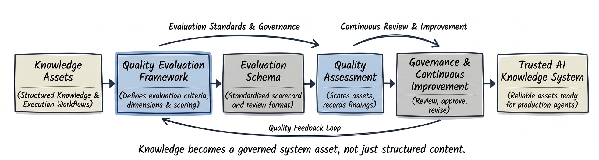

# Subproject 03: Knowledge Quality Evaluator

### Turning AI-ready assets into measurable, governed knowledge systems

Subproject 01 focused on structuring knowledge for AI agents.

Subproject 02 focused on guiding agent behavior through explicit execution workflows.

But creating knowledge and workflows is only part of building a reliable AI-first system.

Organizations also need to know:

- *Is this knowledge complete?*
- *Is this workflow consistent?*
- *Can these assets be trusted by AI agents?*
- *How should quality be measured?*

This subproject focuses on another critical challenge in AI-first systems:

**How do we evaluate the quality of AI-ready knowledge and workflow assets consistently?**

At a high level, quality evaluation provides the governance layer that ensures knowledge and workflows remain reliable as they evolve.



---

## What this subproject is about

The goal is to design a **quality architecture layer** that helps organizations evaluate whether AI-ready knowledge and workflow assets are suitable for reliable agent use.

This includes defining:

- *Evaluation principles*
- *Quality dimensions*
- *Assessment patterns*
- *Review processes*
- *Governance practices*
- *Continuous improvement mechanisms*

The result is a reusable **quality evaluation framework** that enables teams to assess, review, and continuously improve AI-ready assets using consistent criteria rather than subjective judgement.

This mirrors the type of work Knowledge Operations and AI Governance teams perform when maintaining production AI knowledge systems.

---

## The problem being addressed

Creating structured knowledge and workflows does not guarantee they are high quality.

For example:

```text
A workflow may define every required step,
but still contain ambiguous decision criteria.

A knowledge asset may be well structured,
but omit important business constraints.
```

Human reviewers often identify these issues through experience.

AI systems cannot.

Without a structured evaluation process:

- *Knowledge quality becomes inconsistent*
- *Workflow reliability gradually declines*
- *Content reviews become subjective*
- *Governance becomes difficult to scale*
- *Quality improvements become difficult to measure*

As organizations build larger AI knowledge ecosystems, evaluation becomes just as important as knowledge creation.

This subproject addresses that gap by:

- *Defining reusable evaluation criteria*
- *Standardizing quality assessment*
- *Producing measurable quality scores*
- *Supporting continuous improvement through governance*

---

## What's included in this subproject

This subproject includes:

- *A real-world problem statement explaining why AI-ready assets require dedicated quality evaluation*
- *A reusable quality evaluation framework*
- *Evaluation principles and reusable assessment patterns*
- *A machine-readable evaluation schema*
- *Sample evaluation scorecards*
- *Evaluation governance guidelines*
- *A short demo walkthrough*

Each artifact is designed to reflect how AI-first organizations review, govern, and continuously improve operational knowledge assets.

---

## Folder overview

```text
03 Knowledge Quality Evaluator/
│
├── README.md
│
├── problem/
│   └── measuring_ai_knowledge_quality.md
│
├── design/
│   ├── what_is_an_evaluation_framework.md
│   ├── evaluation_principles.md
│   ├── evaluation_vs_validation.md
│   └── evaluation_patterns.md
│
├── schemas/
│   └── quality_evaluation_schema.yaml
│
├── evaluation/
│   ├── knowledge_asset_scorecard.json
│   ├── workflow_asset_scorecard.json
│   └── evaluation_summary.md
│
├── governance/
│   ├── evaluator_guidelines.md
│   └── evaluation_versioning.md
│
└── demo/
    └── demo_notes.md
```

---

## What "Knowledge Quality Evaluation" means here

In this context, knowledge quality evaluation:

- *Measures how effectively AI-ready assets support reliable agent behavior*
- *Uses consistent evaluation criteria instead of subjective reviews*
- *Assesses both knowledge assets and execution workflows*
- *Produces structured evaluation records and quality scores*
- *Supports governance and continuous improvement*
- *Can be applied independently of prompts, models, or user interfaces*

This makes the framework suitable for:

- *Knowledge Operations teams*
- *AI Governance programs*
- *Enterprise documentation systems*
- *Agentic AI platforms*

---

## How this fits into the larger project

Subproject 01 established the knowledge foundation.

Subproject 02 introduced the behavioral layer that guides agent actions.

This project introduces the quality layer that evaluates both knowledge and workflows before they are deployed or reused.

Once assets are:

- *Structured*
- *Reusable*
- *Governed*
- *Evaluated*

It becomes possible to:

- ***Measure knowledge quality consistently***
- ***Identify improvement opportunities***
- ***Support governance through objective evaluation***
- ***Build trustworthy AI knowledge systems***

Together, the first three subprojects establish the core lifecycle of an AI-first knowledge system.

### Subproject 01

**Knowledge Architecture**

Structured knowledge that AI agents can retrieve and reason over.

### Subproject 02

**Behavior Architecture**

Structured workflows that guide AI agent decisions and actions.

### Subproject 03

**Quality Architecture**

Evaluation frameworks that measure, govern, and continuously improve AI-ready knowledge assets.

Together, they enable organizations to:

- *Create reliable knowledge*
- *Guide consistent agent behavior*
- *Measure quality objectively*
- *Continuously improve AI-ready content*

The next subproject builds on this foundation by introducing scalable content operations for creating, maintaining, and governing AI-ready knowledge assets throughout their lifecycle.

---

## Next step within this subproject

The next step is to define what an evaluation framework is and examine why structured evaluation is essential for AI-first knowledge systems.

That will live in:

`design/what_is_an_evaluation_framework.md`
