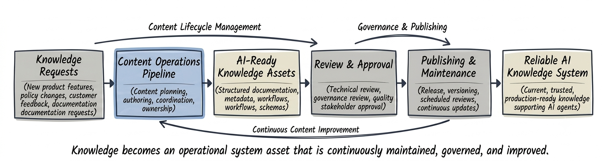

# Subproject 04: Knowledge Operations Pipeline

### Turning AI-ready knowledge into scalable knowledge operations

Subproject 01 focused on structuring knowledge for AI agents.

Subproject 02 focused on guiding agent behavior through explicit execution workflows.

Subproject 03 introduced evaluation frameworks to measure and govern the quality of those assets.

But creating high-quality knowledge is only part of operating an AI-first knowledge system.

Organizations also need to answer questions such as:

- *How is new knowledge requested and prioritized?*
- *Who reviews and approves AI-ready knowledge?*
- *How are knowledge assets maintained as products evolve?*
- *How do teams ensure published knowledge remains accurate over time?*

This subproject focuses on another critical challenge in AI-first systems:

**How do we create, maintain, and improve AI-ready knowledge assets at scale?**

At a high level, knowledge operations provide the processes that ensure AI-ready knowledge remains accurate, governed, and continuously maintained throughout its lifecycle.



---

## What this subproject is about

The goal is to design a **knowledge operations layer** that manages the lifecycle of AI-ready knowledge assets from creation to ongoing maintenance.

This includes defining:

- *knowledge intake and planning*
- *Authoring standards*
- *Review and approval workflows*
- *Publishing processes*
- *Version management*
- *Knowledge maintenance*

The result is a repeatable operational framework that enables organizations to scale AI-ready knowledge without sacrificing quality, consistency, or governance.

This mirrors the type of work Knowledge Operations and AI knowledge teams perform when managing production knowledge systems.

---

## The problem being addressed

Creating high-quality knowledge assets is not enough if there is no repeatable process for managing them.

For example:

```text
A new product feature is released.

The documentation is updated.

But related workflows, policies,
and supporting knowledge assets
remain outdated.
```

Human teams may eventually identify these inconsistencies.

AI agents cannot.

Without structured knowledge operations:

- *Knowledge becomes outdated over time*
- *Knowledge quality varies between authors*
- *Review processes become inconsistent*
- *Publishing lacks governance*
- *Changes are difficult to trace and maintain*

As AI knowledge ecosystems continue to grow, operational processes become just as important as knowledge quality.

This subproject addresses that gap by:

- *Defining repeatable knowledge operations*
- *Standardizing authoring and review*
- *Supporting governed publishing workflows*
- *Managing knowledge throughout its lifecycle*

---

## What's included in this subproject

This subproject includes:

- *A real-world problem statement explaining why AI-ready knowledge requires structured knowledge operations*
- *knowledge lifecycle and operational design documentation*
- *Reusable knowledge workflow definitions*
- *A machine-readable knowledge asset schema*
- *Governance guidelines for authoring and publishing*
- *knowledge quality evaluation metrics*
- *A short demo walkthrough*

Each artifact is designed to reflect how AI-first organizations operationalize knowledge creation and maintenance at scale.

---

## Folder overview

```text
04 AI knowledge Operations Pipeline/
│
├── README.md
│
├── problem/
│   └── scaling_ai_ready_knowledge.md
│
├── design/
│   ├── knowledge_operations_overview.md
│   ├── knowledge_lifecycle.md
│   ├── authoring_principles.md
│   └── knowledge_workflow_patterns.md
│
├── schemas/
│   └── knowledge_asset_schema.yaml
│
├── pipeline/
│   ├── knowledge_intake_workflow.yaml
│   ├── knowledge_review_workflow.yaml
│   └── publishing_workflow.yaml
│
├── governance/
│   ├── knowledge_governance.md
│   └── knowledge_versioning.md
│
├── evaluation/
│   ├── knowledge_quality_metrics.md
│   └── sample_knowledge_evaluation.json
│
└── demo/
    └── demo_notes.md
```

---

## What "AI knowledge Operations" means here

In this context, AI knowledge Operations:

- *Defines how AI-ready knowledge assets are created, reviewed, and maintained*
- *Standardizes authoring and publishing processes*
- *Supports governance throughout the knowledge lifecycle*
- *Coordinates multiple contributors through repeatable workflows*
- *Ensures knowledge remains accurate as products and policies evolve*
- *Can be implemented independently of AI models and user interfaces*

This makes knowledge operations suitable for:

- *Knowledge Operations teams*
- *AI knowledge Design*
- *Enterprise documentation programs*
- *AI-first product organizations*

---

## How this fits into the larger project

Subproject 01 established the knowledge foundation.

Subproject 02 introduced structured behavior through execution workflows.

Subproject 03 added quality evaluation and governance.

This project introduces the operational layer responsible for managing the lifecycle of AI-ready knowledge assets.

Once knowledge is:

- *Structured*
- *Governed*
- *Evaluated*
- *Operationalized*

It becomes possible to:

- ***Scale AI-ready knowledge across teams***
- ***Maintain knowledge quality over time***
- ***Standardize authoring and publishing***
- ***Support continuous knowledge improvement***

Together, the first four subprojects establish the operational foundation of an AI-first knowledge system.

### Subproject 01

**Knowledge Architecture**

Structured knowledge that AI agents can retrieve and reason over.

### Subproject 02

**Behavior Architecture**

Structured workflows that guide AI agent decisions and actions.

### Subproject 03

**Quality Architecture**

Evaluation frameworks that measure and govern AI-ready knowledge assets.

### Subproject 04

**Knowledge Operations**

Operational processes that create, maintain, publish, and continuously improve AI-ready knowledge.

Together, they enable organizations to:

- *Design reliable knowledge systems*
- *Guide consistent AI behavior*
- *Measure and improve knowledge quality*
- *Operate AI-ready knowledge at scale*

The next subproject builds on this foundation by connecting governed knowledge assets with external tools and business systems, enabling AI agents to perform real-world actions safely and consistently.

---

## Next step within this subproject

The next step is to define why scaling AI-ready knowledge requires dedicated knowledge operations rather than traditional documentation processes.

That will live in:

`problem/scaling_ai_ready_knowledge.md`
