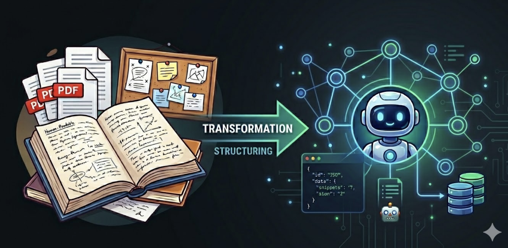

# AI-First Knowledge Architecture for Agentic Systems

### Designing knowledge systems for reliable AI agents.

As organizations adopt autonomous AI systems, knowledge is no longer created solely for human readers. It must also be structured so AI agents can retrieve it, reason over it, follow approved workflows, and operate consistently. 

This repository demonstrates how traditional documentation can be evolved into governed knowledge systems that support reliable AI behavior and reflect the types of challenges addressed by **Knowledge Architects**, **AI Content Designers**, and **Knowledge Operations** teams building AI-first products.

Rather than treating knowledge as static documentation, the project treats it as a **first-class system asset**:

***Structured, versioned, evaluated, and continuously improved throughout its lifecycle***. 



---

## What this project is trying to solve

As AI systems evolve from conversational assistants to **multi-step autonomous agents**, organizations face a new set of knowledge management challenges:

- *Documentation written for humans is difficult for AI agents to interpret consistently*
- *Ambiguous or incomplete content leads to unreliable agent behavior*
- *Knowledge assets lack standardized governance and quality evaluation*
- *Scaling AI-ready knowledge systems requires repeatable operational processes*
- *Changes to knowledge are difficult to validate before deployment*

This repository explores practical approaches to:

- *Transform human documentation into structured AI-ready knowledge assets*
- *Guide agent behavior through explicit execution workflows*
- *Evaluate the quality and governance readiness of knowledge assets*
- *Design scalable content operations for creating, maintaining, and governing AI-ready knowledge assets*
- *Connect governed knowledge with external tools and business systems*

Together, these subprojects demonstrate how AI-first organizations can build knowledge systems that are reliable, reusable, measurable, and designed for continuous improvement.

**The result is a production-inspired blueprint for designing AI-first knowledge systems.**

---

## Repository Focus

Rather than demonstrating AI model implementation, this repository focuses on the systems that enable AI agents to operate reliably within organizations.

### Knowledge Architecture

- Structuring documentation into AI-ready knowledge assets
- Designing reusable knowledge schemas
- Organizing information for reliable retrieval and reasoning

### Behavior Architecture

- Defining explicit execution workflows
- Modeling business processes as operational knowledge
- Guiding consistent agent behavior

### Quality Architecture

- Measuring the quality and governance readiness of knowledge and workflow assets
- Defining reusable evaluation frameworks and review processes
- Supporting continuous improvement through structured assessment

### Content Operations

- Designing scalable pipelines for producing AI-ready knowledge assets
- Standardizing authoring, review, and publishing processes
- Managing knowledge throughout its lifecycle

### System Integration

- Connecting governed knowledge with external tools and business systems
- Demonstrating how structured knowledge supports reliable AI operations

---

## How the project is structured

The repository is intentionally organized to mirror how AI-first knowledge systems evolve in production:

**Knowledge Architecture → Behavior Architecture → Quality Architecture → Content Operations → System Integration**

Each subproject builds on the previous one, demonstrating how documentation evolves into a governed knowledge system capable of supporting reliable AI agents at scale.

```
AI-First-Knowledge-Architecture/
│
├── 01 Agent Ready Knowledge Base/                 # Knowledge Architecture
├── 02 Agent Execution Workflows/                  # Behavior Architecture
├── 03 Knowledge Quality Evaluator/                # Quality Architecture 
├── 04 AI Content Operations Pipeline/             # Content Operations 
├── 05 Tool Using Agent System/                    # Tool-Using Agents  
│
├── Shared/
│   ├── schemas/
│   ├── evaluation-metrics/
│   └── sample-data/
│
└── Docs/
    ├── architecture-diagrams/
    ├── demos/
    └── case-notes/
```

Each subproject can be explored independently, but together they form a **cohesive knowledge architecture** for agentic systems.

---

## Subprojects overview

### 1. Agent-Ready Knowledge Base
Transforms traditional documentation into structured, metadata-rich knowledge assets that AI agents can reliably retrieve, interpret, and reason over.

**Core Question Addressed:** *How do we transform human documentation into AI-ready knowledge?*

### 2. Agent Execution Workflows
Designs structured execution workflows that help AI agents make consistent decisions, follow business processes, and produce predictable outcomes.

**Core Question Addressed:** *How do we guide AI agents to act consistently?*

### 3. Knowledge Quality Evaluator
Introduces a reusable knowledge governance framework for evaluating the quality, consistency, and governance readiness of AI-ready knowledge and workflow assets.

**Core Question Addressed:** *How do we measure and govern the quality of AI-ready assets?*

### 4. AI Content Operations Pipeline
Designs scalable content operations for planning, creating, reviewing, publishing, and maintaining AI-ready knowledge assets throughout their lifecycle.

**Core Question Addressed:** *How do we operationalize the creation, maintenance, and evolution of AI-ready knowledge assets at scale?*

### 5. Tool-Using Agent System
Demonstrates how governed knowledge and execution workflows enable AI agents to safely integrate with external tools and business systems.

**Core Question Addressed:** *How do governed knowledge assets connect with external tools and business systems?*

---

## How each project stage mirrors real production work

Each subproject is designed to reflect how AI-ready knowledge systems are developed and governed within real organizations.

Rather than focusing on model implementation, each stage addresses a distinct capability required to operate AI systems reliably:

- Knowledge is structured into reusable, AI-ready assets
- Agent behavior is guided through explicit workflows rather than implicit reasoning
- Quality is measured using standardized evaluation frameworks
- Content is governed through repeatable operational processes
- Schemas, governance, and documentation evolve alongside the system
- Trade-offs, assumptions, and limitations are documented as first-class design artifacts

This repository is not about building increasingly capable AI models. It is about designing the knowledge, governance, and operational systems that enable AI agents to operate reliably at scale.

---

## What you'll find inside each subproject

Every subproject follows a consistent structure and includes:

- A real-world problem statement
- An architecture diagram illustrating the system design
- Design principles and supporting documentation
- Schemas defining reusable knowledge structures
- Representative implementation assets
- Governance guidelines for maintaining consistency
- Evaluation criteria and sample assessments
- Demo notes suitable for interview walkthroughs

The structure reflects how AI-ready knowledge systems are designed, documented, and governed within production environments.

---

## How this repository is meant to be used

This repository is neither a tutorial nor a software framework.

It is a **production-inspired portfolio** that demonstrates how AI-ready knowledge systems can be designed, governed, evaluated, and operationalized.

Each subproject can be used as:

- A reference architecture for AI knowledge systems
- A discussion artifact during technical and design interviews
- A collection of reusable patterns for Knowledge Architecture, AI Content Operations, and Knowledge Governance

The focus is not on model implementation, but on the systems and processes that enable AI agents to operate reliably.

---

## How this work progresses

The repository follows the lifecycle of an AI-first knowledge system.

Each subproject builds on the capabilities introduced by the previous one:

- **Knowledge Architecture** — Transform human documentation into AI-ready knowledge assets.
- **Behavior Architecture** — Define structured workflows that guide consistent agent behavior.
- **Quality Architecture** — Evaluate and govern AI-ready knowledge and workflow assets.
- **Content Operations** — Scale the creation, maintenance, and governance of AI-ready knowledge assets.
- **System Integration** — Connect governed knowledge assets with external tools and business systems.

This progression mirrors how AI-first organizations evolve from creating structured knowledge to operating complete knowledge systems that support reliable agent behavior.
